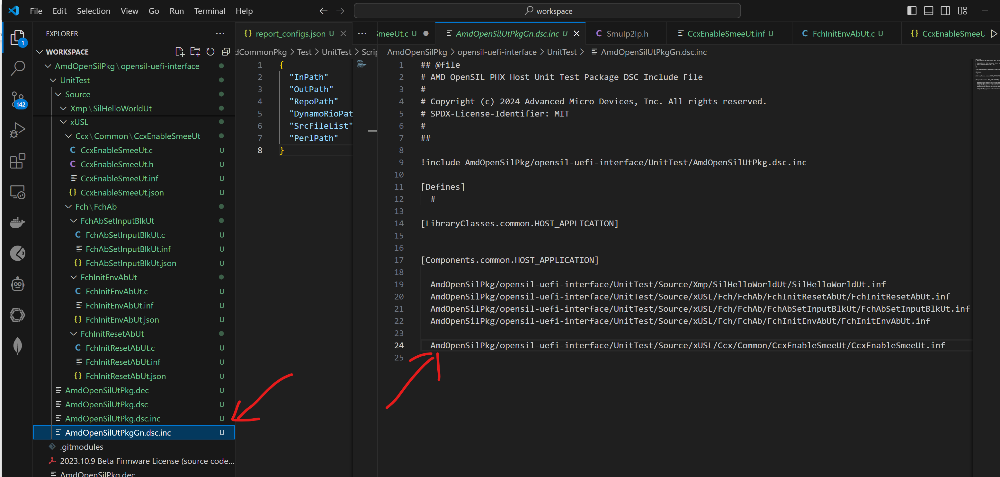
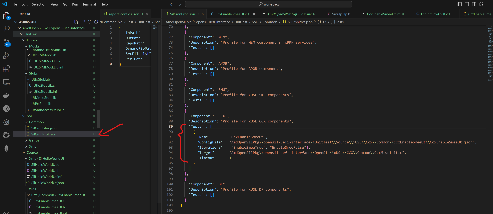
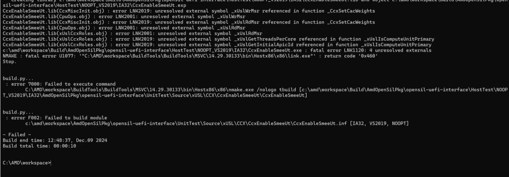
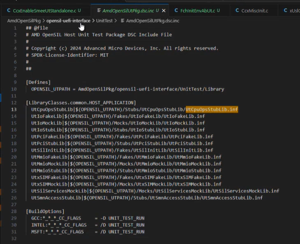
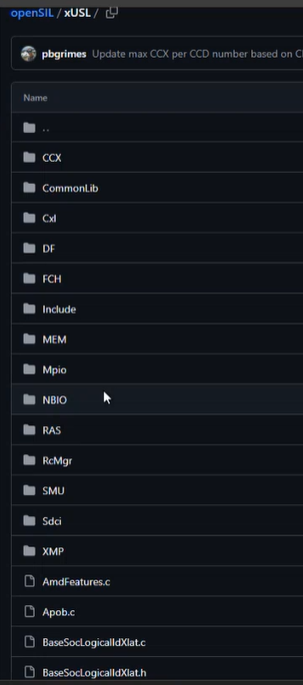
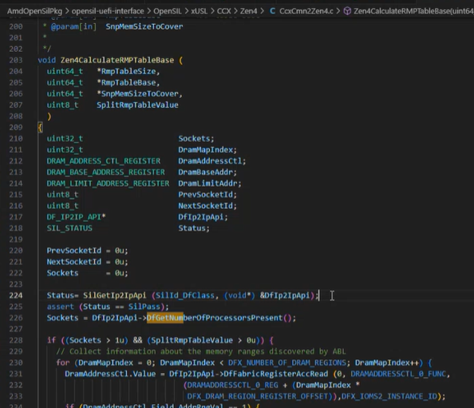

# Phase Two - Intro to Unit Test

## Table of Contents
1. [Session #2](#Session-2)
2. [Session #3](#Session-3)
3. [Session #4](#Session-4)
4. [Session #5](#Session-5)


## Session 2
1. Go here -> ``` cd C:\Develop\unittest\AmdOpenSilPkg\opensil-uefi-interface\UnitTest\Source\Xmp\ ``` 

2. The .inf file -> Every UT has an .inf file; it is an instruction set describing what are needed to build the UT module; it has a RIGID structure.

3. FILE_GUID: It is an unique ID hash. <br>
MODULE_TYPE: Should be the same for all tests. <br>
VERSION_STRING: Should be the same. <br>

4. [SOURCES]: Whatever you need to compile this UT.
    - Minimum 2 source files should be here: function you're trying to test + your .c file which declares the test
    - For example, in the following, the 1st file is the UT, the 2nd and 3rd files are the test targets. <br>
``` 
    [Sources]
        FchAbSetInputBlkUt.c
        ../../../../../../../../AmdOpenSilPkg/opensil-uefi-interface/OpenSIL/xUSL/FCH/Common/MultiFch/MultiFchInit.h
        ../../../../../../../../AmdOpenSilPkg/opensil-uefi-interface/OpenSIL/xUSL/FCH/Common/FchCore/FchAb/FchAb.c 
```

5. [Packages]: .dec decoration files, how EDK defines .inf files. Can look up EDK specs and it describes all the definitions needed for dependencies. (UEFI standards for all devices).

6. [LibraryClasses]: Think of them as #includes; they are libs that we need to bring into UT for some uses. Important part is that they allow us to do fakes, mocks, and stubs. Common ones to include are:
```
[LibraryClasses]
    UtBaseLib               // always include this
    UtIoMockLib             // low level io stuff, "mocks" actual IOs
    UtPciStubLib            
    UtMmioMockLib
    UtxSIMMockLib
    UtSmnAccessStubLib
    UtSilServicesMockLib
```

7. To be careful -> if a function to be tested, calls something outside from it, then there is a good chance there already exists a mock for it.

8. Fakes, Mocks, and Stubs are all inside here ``` C:\Develop\unittest\AmdOpenSilPkg\opensil-uefi-interface\UnitTest\Library ``` <br>
We should get familiar with these tools.

9. Back to the HelloWorld example under ~/XML/ <br>
There is always a .json file -> Keeps track of different branches of test cases because we will have multiple test branches just like a tree, and we need to perform an exhuastive search for all possible test cases. <br>

10. Let's look at this piece of .json file: <br>
```
[
  {
    "Iteration": "Default",
    "WelcomeMessage": "SilHelloWorldUt",
    "WelcomeMessageId": 123
  }
]
``` 
- Note that you can put "input variables" in WelcomeMessageId, and retrieve it inside the test's main().

11. Now go through the documentation: <br>
https://github.com/openSIL/unit_test_framework/blob/genoa_poc/documentation/UnitTestFramework.rst

    - UT source structure: 4 functions -> main, TestPrerequisuite, TestBody, TestCleanUp
    - Test Trio = TestPrerequisuite, TestBody, TestCleanUp

12. Pay attention to API call:
    - ``` Status = UtSilInit(); ``` // initializes OpenSIL API; critical to initializes before doing anything.

13. Pay attention to the TestBody function, it has similar starting codes like TestInit. (Described in recording #2 1:16:00)

14. In the TestBody, the if-else tree is where all the branches of tests reside.

15. We should clean up all inside TestCleanUp.

16. In summary, there are a lot of boiler plate for Logging messages. We can re-use them.

17. Looking at FchInitEnvABUt.c
    - In the test body, there should be "Arrange", "Act", "Assert"
        - Arrange -> declare variables, etc.
        - Act -> calling the unit-under-test function.
        - Assert -> checking output of the function, and see if it works.

18. Study carefully on the comments of ``` FchInitEnvAbUt.c ```

19. Remember if we run the command, then we can see the results both in terminal and in the report -> ``` cd C:\Develop\unittest\unit_test_framework\Platform\AmdCommonPkg\Test\UnitTest\Scripts\Dispatcher ```

20. Recap: always remember to have 2 terminal windows opened for compilation of the new unit-test, and the directories are: <br>
``` cd C:\Develop\unittest\unit_test_framework\Platform\AmdCommonPkg\Test\UnitTest\Scripts\Dispatcher ``` <br>
``` cd C:\Develop\unittest\unit_test_framework\Platform\AmdCommonPkg\Test\UnitTest\Scripts\Coverage ``` <br>
Also, remember the two scripts are: <br>
``` python dispatcher.py dispatcher_configs.json ``` <br>
``` python report.py report_configs.json ``` <br>


## Session 3

21. Now, with everything set up properly, we need to care about the "inclusion" of packages + specific unit tests into an "index" file (so the compiler knows where to find the specific unit test). <br>
The first file we will look at is: <br>
``` cd C:\Develop\unittest\AmdOpenSilPkg\opensil-uefi-interface\UnitTest\AmdOpenSilUtPkgGn.dsc.inc ``` <br>
We can register new new tests here under [Components.common.HOST_APPLICATION] section.

22. Remember ---> after modification, we will need to call ``` dbuild.cmd clean ``` followed by the ``` dbuild.cmd ut UnitTest\AgesaModuleUtPkgGn.dsc ```

23. Stubs -> just return canned values. Returns either valid or invalid values for the sake of testing.

24. Fakes -> opposite to Stubs, you actually "implements" whatever module is needed, but is still decoupled from external real stuff.

25. Mocks -> somewhere in the middle b/t Stubs and Fakes, more complex Stub, but not complete model of implementation. E.g. if we want to test a specific iteration of something, we can "Mock" the dependency objects.

26. Stubs, Fakes, and Mocks are located inside ``` cd C:\Develop\unittest\AmdOpenSilPkg\opensil-uefi-interface\UnitTest\Library ```

27. There is a good example at ``` cd C:\Develop\unittest\AmdOpenSilPkg\opensil-uefi-interface\UnitTest\Library\Mocks\UtMmioMockLib\UtMmioMockLib.c ``` <br>
In line #441 and the subsequent lines, we see the usage of "AND" "OR" masks to set/reset bits. <br>
In line #123, we see the usage of calling an API function which passes in function ptr with some other parameters.

28. Important takeaway from this session: <br>
Follow the following procedure to build a UT succesfully -
    - the following 2 files needed to be modified to include the test cases
        - ``` C:\Develop\unittest\AmdOpenSilPkg\opensil-uefi-interface\UnitTest\AmdOpenSilUtPkgGn.dsc.inc ``` 
        - ``` C:\Develop\unittest\AmdOpenSilPkg\opensil-uefi-interface\UnitTest\SoC\Common\SilCmnProf.json ```
        -  <br>
        -  <br>
    - Next, we will need to go back to ./unittest/ and run ``` dbuild.cmd clean ``` followed by ``` dbuild.cmd ut UnitTest\AgesaModuleUtPkgGn.dsc ```
    - Next, we will run ``` cd C:\Develop\unittest\unit_test_framework\Platform\AmdCommonPkg\Test\UnitTest\Scripts\Dispatcher ``` <br>
    followed by ``` python dispatcher.py dispatcher_configs.json ``` 
    - Next, we will run ``` cd C:\Develop\unittest\unit_test_framework\Platform\AmdCommonPkg\Test\UnitTest\Scripts\Coverage ``` <br>
    followed by ``` python report.py report_configs.json ```
    - Next, the final results will be shown in: <br>
    ``` cd C:/Develop/unittest/Results/index.html ``` <br>
    ``` cd C:/Develop/unittest/Results/report/index.html ```


## Session 4

29. This section is a deep dive into CcxEnableSmee() function at line #190 from ``` C:\Develop\unittest\AmdOpenSilPkg\opensil-uefi-interface\OpenSIL\xUSL\CCX\Common\CcxMiscInit.c ```

30. When we compile, if we see the following error, then it may be the fact that some external modules are used, so we need to implement mocks or similar for resolving the undeclared externals. <br>
 <br>
From the above "unresolved external" cases, we will need to stub it with something similar to the following: <br>
``` 
bool xUslIsComputeUnitPrimary (
  void
  )
{
  return TRUE;
}
```

31. When we write UTs, we need to decide whether or not stubs are needed, but we don't know. To resolve this, we might need to go through the API libraries and see we can just use them. <br>
At this point, the following libs are included in most tests we write: <br>

32. Now let's go through the procedure of making your own lib. <br>
For example, if we want to make a new stub lib: <br>
    - ``` cd C:\Develop\unittest\AmdOpenSilPkg\opensil-uefi-interface\UnitTest\Library\Stubs ```
    - Creates a new folder named ``` UtXXXXXXStubLib ```, for example ``` UtCpuOpsStubLib.c ``` 
    - Then, we need to create ``` UtCpuOpsStubLib.inf ``` , can use other .inf as reference 
    - Then, we need to register the .inf file into the system.
        - under ``` C:\Develop\unittest\unit_test_framework\AmdOpenSilPkg\opensil-uefi-interface\UnitTest\AmdOpenSilUtPkg.dsc.inc ```
        - 


# Session 5

33. We take some time to introduce openSIL: <br>
There are 3 main modules -> xPRF, xSIM, xUSL <br>
xUSL is where the silicon initialization lives, and we will be dealing with it most. <br>
There are many IPs (aka modules) inside xUSL. <br> 


34. IP to IP API is a specific method to connect different IPs together. Adapter pattern. <br>
The API -> a table of function ptrs. <br>
    - Function ptrs do different things.
    - OpenSIL does not allow calling functions from another IP directly.  

35. An example can be found here: <br>
    - Note that it is using the vector table @ ``` C:\Develop\unittest\AmdOpenSilPkg\opensil-uefi-interface\OpenSIL\Include\xSIM-api.h ``` <br>


36. Now we need to stub, mock, or fake dummy API for testing when time comes. 

37. At this point, we've talked about "inter-IP" communication via IP to IP API.
    - This IP to IP API is basically an adapter design pattern.

38. There is also the concept of "intra-IP" communication using TRANSFER TABLE. 
    - TRANSFER TABLE is a decorator design pattern.

39. Let's talk about IP-to-IP adapter:
    - It is a table of function pointers.
    - We need to provide a table when UUT is calling one of the function pointers. 
    - Example walkthrough below ()
    - ``` cd C:\Develop\unittest\AmdOpenSilPkg\opensil-uefi-interface\OpenSIL\xUSL\DF\Common\BaseFabricTopologyCmn.c ```

```cpp
/* ~\unittest\AmdOpenSilPkg\opensil-uefi-interface\OpenSIL\xUSL\DF\Common\BaseFabricTopologyCmn.c */

SIL_STATUS
DfGetProcessorInfo (
  uint32_t SocketIndex,
  uint32_t *DieCount,
  uint32_t *RootBridgeCount
  )
{
  DF_COMMON_2_REV_XFER_BLOCK* DfXfer;
  SIL_STATUS                  Status;

  Status = SilGetCommon2RevXferTable (SilId_DfClass, (void**) &DfXfer);
  assert (Status == SilPass);

  /*
   * If any pointer input is != NULL, do not assert.  We should only assert if
   * all inputs are NULL since this function call would be unecessary.  This
   * check is only valid for debug builds.
   */
  assert ((DieCount != NULL) || (RootBridgeCount != NULL));

  if (SocketIndex >= DfXfer->DfGetNumberOfProcessorsPresent ()) {
    return SilInvalidParameter;
  }

  if (DieCount != NULL) {
    *DieCount = (uint32_t) DfGetNumberOfDiesOnSocket();
  }

  if (RootBridgeCount != NULL) {
    *RootBridgeCount = (uint32_t) DfXfer->DfGetNumberOfRootBridgesOnSocket (SocketIndex);
  }

  return SilPass;
}
```
<br>

```cpp
/* Loose codes for DfGetProcessorinfoUt.c */

HOST_DEBUG_SERVICE mHostDebugService = NULL;

// vector table (function ptr); needs to be instantiated for making the Ut work.
// put a DOT before the function pointers.
// NULL just means we don't use it for the current UUT
DF_COMMON_2_REV_XFER_BLOCK DfCmn2RevPhxXfer = {
    .DfFabricRegisterAccRead            =       NULL,      
    .DfFabricRegisterAccWrite           =       NULL,
    .DfGetNumberOfProcessorsPresent     =       GetNumberOfProcessorsPresentUt,
    .DfGetNumberOfSystemDies            =       GetNumberOfSystemDieUt,
    .DfGetNumberOfSystemRootBridges     =       NULL,
    .DfGetNumberOfRootBridgesOnSocekt   =       GetNumberOfRootBridgesOnSocketUt,
    // more function pointers below, but all initialized to NULL
};

UINT32
GetNumberOfProcessorsPresentUt (    // stub
    void
)
{
    return 1;
}

UINT32
GetNumberOfRootBridgesOnSocketUt (  // stub
    UINT32 Socket
)
{
    return 1;
}

UINT32
GetNumberOfSystemDiesUt (           // stub
    void
)
{
    return 1;
}
```
